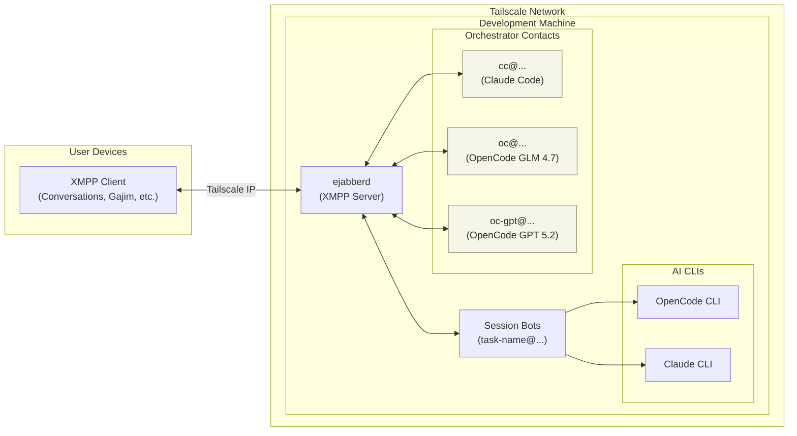
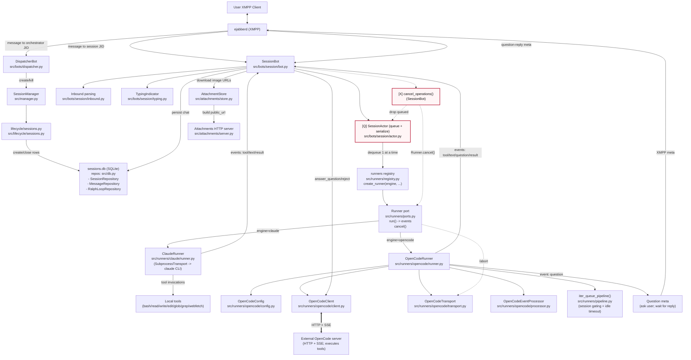

# Architecture

## Overview

Switch creates a chat-based interface for AI coding assistants. Each conversation session becomes a separate XMPP contact, allowing you to manage multiple concurrent AI conversations from any XMPP client (Conversations, Gajim, Dino, etc.).

The codebase lives at `~/switch`. AI agents working on this project should reference `~/switch/AGENTS.md` for conventions and `~/switch/memory/` for persistent context.

<!-- DIAGRAM:system -->
<!-- (auto-generated by scripts/sync-diagrams.py; edit docs/diagrams/system.mermaid) -->

<!-- /DIAGRAM:system -->

<!-- DIAGRAM:system-detailed -->
<!-- (auto-generated by scripts/sync-diagrams.py; edit docs/diagrams/system-detailed.mermaid) -->

<!-- /DIAGRAM:system-detailed -->

To keep this diagram consistent across docs, update `docs/diagrams/system.mermaid` and run:

```bash
python3 scripts/sync-diagrams.py
```

## Network Topology

Switch runs entirely within a **Tailscale network** (tailnet):

- **XMPP Server (ejabberd)**: Runs on the dev machine, listens on its Tailscale IP
- **User's XMPP Client**: Connects via Tailscale - no port forwarding or public exposure needed
- **All bots**: Connect locally to ejabberd on the same machine

This means:
- You need ejabberd installed and configured on the dev machine
- Your XMPP client connects to the machine's Tailscale IP (e.g., `100.x.x.x`)
- Everything stays private within your tailnet

## Components

### Orchestrator Contacts

Multiple orchestrators, each tied to a specific AI engine:

| Contact | Engine | Model |
|---------|--------|-------|
| `cc@domain` | Claude Code | Opus |
| `oc@domain` | OpenCode | GLM 4.7 |
| `oc-gpt@domain` | OpenCode | GPT 5.2 |
| `oc-glm-zen@domain` | OpenCode | GLM 4.7 (Zen) |
| `oc-gpt-or@domain` | OpenCode | GPT 5.2 (OpenRouter) |
| `oc-kimi-coding@domain` | OpenCode | Kimi K2.5 (Kimi for Coding) |

Send any message to an orchestrator to create a new session using that engine. Each orchestrator handles:

- Session creation with auto-generated names from message content
- Global commands (`/list`, `/kill`, `/recent`, `/help`)

### Session Bots (`session-name@domain`)

One bot per conversation. Each session:

- Has its own XMPP account (created dynamically via ejabberdctl)
- Maintains conversation context with the AI backend
- Can switch between OpenCode and Claude engines
- Tracks costs, tokens, and tool usage

### Session Manager

Coordinates all bots:

- Starts/stops session bots
- Restores active sessions on restart
- Manages XMPP account lifecycle

### Lifecycle (Source of Truth)

Session create/kill semantics are centralized in:

- `src/lifecycle/sessions.py`

Dispatcher bots, session bots, and shell scripts should delegate to this module
to avoid drift.

## Data Flow

1. **New Session**: Message to orchestrator (cc/oc/oc-gpt) → slugify name → create XMPP account → spawn SessionBot with engine config → process first message

2. **Continuing Session**: Message to session contact → SessionBot receives → run AI backend → stream response back

3. **Session Output**: All AI output logged to `~/switch/output/<session>.log` for debugging and `/peek` command

## Database Schema

SQLite database (`~/switch/sessions.db`) stores:

```sql
sessions (
    name TEXT PRIMARY KEY,        -- e.g., "fix-auth-bug"
    xmpp_jid TEXT,                -- e.g., "fix-auth-bug@domain"
    xmpp_password TEXT,
    claude_session_id TEXT,       -- For resuming Claude conversations
    opencode_session_id TEXT,     -- For resuming OpenCode conversations
    active_engine TEXT,           -- "opencode" or "claude"
    model_id TEXT,                -- OpenCode model selection
    status TEXT                   -- "active" or "closed"
)
```

## AI Backends

### OpenCode

- Runs `opencode run --format json`
- Parses streaming JSON events
- Supports model selection and reasoning modes
- Tracks detailed token usage

### Claude Code

- Runs `claude -p --output-format stream-json`
- Parses streaming JSON events
- Uses Opus model
- Supports session resumption

## Ralph Loop

Autonomous iteration system for long-running tasks:

```
/ralph 20 Fix all type errors --wait 5
```

Runs the AI in a loop until:
- Max iterations reached
- Completion promise detected in output
- Manual cancellation via `/ralph-cancel`
- Wait interval between iterations (default ~0.03 min, configurable with `--wait`)
